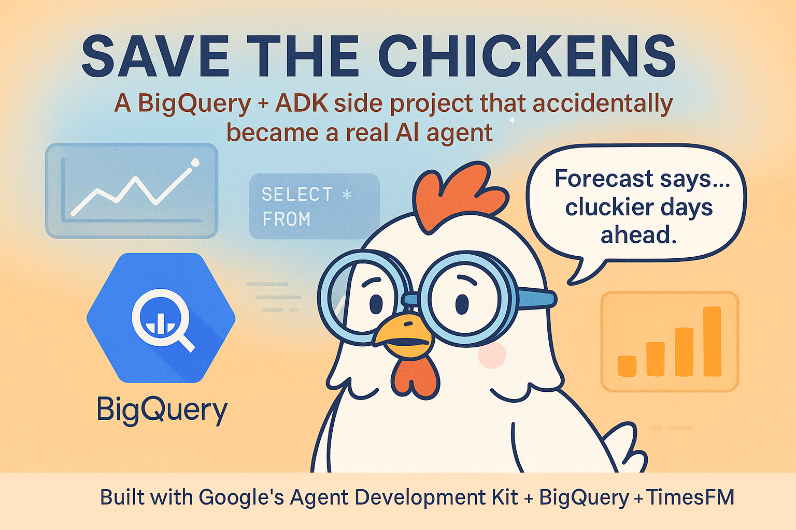
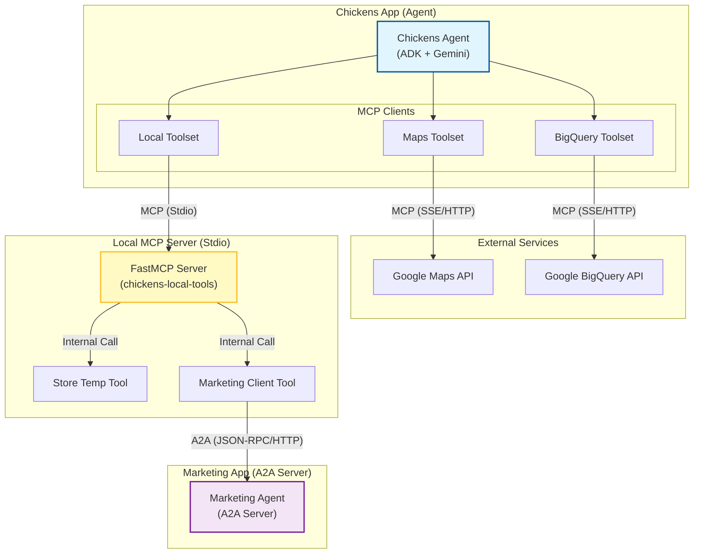

# Save the Chickens 🐔

A sample application demonstrating an **Agentic Workflow** using **MCP (Model Context Protocol)** and **A2A (Agent-to-Agent)** communication.

## Architecture

The system consists of a primary **Chickens Agent** that orchestrates operations by connecting to various MCP tools:

1.  **Google Maps Platform** (via MCP): For location search and routing.
2.  **Google BigQuery** (via MCP): For inventory and sales data analysis.
3.  **Local MCP Server** (via MCP Stdio):
    *   **Store Temperature IoT**: Simulates getting sensor data.
    *   **Marketing Agent Client**: Connects to the Marketing Agent Server via A2A.

### Diagram



## Components

### 1. Chickens Agent (`chickens_app`)
-   **Role**: Main Orchestrator.
-   **Tech**: Google ADK, Gemini 2.5 Flash, MCP Clients.
-   **Instructions**: `chickens_app/agent_instructions.txt`.
-   **Config**: `chickens_app/agent.py`.

### 2. Local MCP Server (`mcp_server`)
-   **Role**: Hosts local tools and clients.
-   **Tech**: `mcp[fastmcp]`, standard `python -m mcp_server.server` execution.
-   **Tools**:
    -   `get_store_temperature(store_id)`
    -   `consult_marketing_expert(context, goal)`

### 3. Marketing Agent (`marketing_app`)
-   **Role**: Specialist agent for creative content.
-   **Tech**: A2A SDK (`a2a-python`), Running on port 8001.
-   **Protocol**: Agent2Agent (JSON-RPC over HTTP).

## Setup & Running

1.  **Environment Variables**:
    Ensure `.env` contains:
    ```bash
    GOOGLE_CLOUD_PROJECT=...
    GOOGLE_CLOUD_LOCATION=global    
    MAPS_API_KEY=... # Optional - if you want to use maps tools
    BIGQUERY_DATASET=...
    MODEL_NAME=gemini-3-flash-preview  # Optional: Defaults to gemini-2.5-flash if not set
    ```

2.  **Start Application**:
    This script will launch the Marketing Agent Server (background) and the Chickens Agent Web UI.
    ```bash
    ./start_web.sh
    ```

## Development

-   **Refactoring**: The project was recently refactored to use a standard MCP server pattern (`mcp_server` package) instead of ad-hoc functions.
-   **Verification**: Run the agents and check logs for "Local MCP Toolset configured" and successful A2A calls.

## Patched SDK
This project uses a locally patched version of the `a2a-python` SDK located in `.a2a_source`.
-   **Reason**: The upstream `a2a-python` SDK currently has two critical issues that prevent it from working in this environment:
    1.  **Strict Type Validation**: The SDK's `prepare_response_object` uses rigid `isinstance` checks that fail even when valid data is returned (e.g., rejecting a `SendMessageResponse` because it expects a `Message`).
    2.  **Request Deserialization**: The JSON-RPC handler expects a strict nesting structure for `params` that conflicts with how Starlette/FastAPI sometimes unwraps requests, causing `AttributeError`.
-   **Usage**: The `marketing_app/server.py` script automatically adds this directory to the Python path (`sys.path.insert(0, ...)`).
-   **Note**: We have explicitly un-ignored this directory in `.gitignore` so that these critical patches are committed to the repository and available to all users. Cloning the official SDK would break the application.
