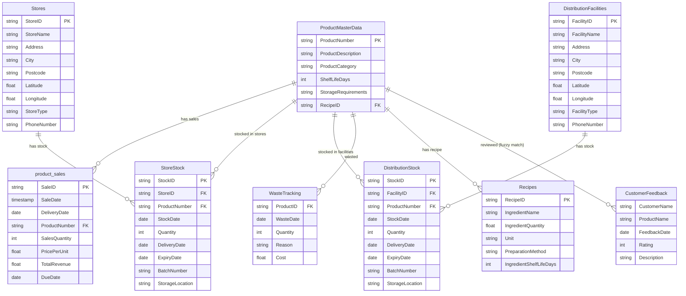

# Save the Chickens - Retail Operations AI Agent (ADK + MCP + A2A)

A production-ready reference implementation of an autonomous retail agent built with **Google's Agent Development Kit (ADK)**. Features **Model Context Protocol (MCP)** for secure tool integration (BigQuery, IoT) and **Agent-to-Agent (A2A)** collaboration for creative workflows.

**What it does:**
- **Natural Language BI**: Query sales, inventory, and waste data using plain English.
- **IoT Integration**: Check real-time freezer temperatures (Mock).
- **Agent-to-Agent (A2A)**: Delegates creative tasks to a specialized Marketing Agent.
- **Agentic Workflow**: Uses Gemini 2.5 Flash to reason across multiple data sources.
- **Modular Architecture**: Built on MCP for easy extensibility.

> **Technical Details**: For a deep dive into the architecture, MCP implementation, and agent configuration, see [chickens_app/README.md](chickens_app/README.md).

## Implementation Overview

This project demonstrates a production-ready agent architecture:

1.  **MCP-First Design**:
    - The agent does not call BigQuery directly. It uses the **Model Context Protocol (MCP)** to communicate with a dedicated tools server.
    - This decouples the "Reasoning Engine" (Agent) from the "Execution Engine" (Tools), allowing for safer, more modular deployments.

2.  **Multi-Agent Collaboration (A2A)**:
    - **Main Agent**: Handles data analysis, SQL generation, and operational logic.
    - **Marketing Agent**: A specialized sub-agent for creative writing.
    - The Main Agent delegates tasks to the Marketing Agent using the `consult_marketing_expert` tool, demonstrating how specialized agents can work together.

    > **Note on Agent Visibility**: You will only see the **Chickens Agent** in the Web UI. This is by design.
    > *   **The Manager (Chickens Agent)**: User-facing, coordinates all work.
    > *   **The Employee (Marketing Agent)**: Backend-only, "hired" by the Manager to do specific tasks.
    > This "Manager-Employee" model keeps the UI clean while allowing for complex, multi-agent backends.

3.  **Hybrid Tooling**:
    - Combines **Database Tools** (BigQuery SQL) with **Real-time Tools** (IoT Mock).
    - Shows how an agent can reason across static data and dynamic real-world states.

## Quick Start

### Prerequisites
- Python 3.10+
- Google Cloud Project with BigQuery enabled
- Vertex AI API enabled

### Setup

1.  **Authenticate**
    ```bash
    gcloud auth application-default login
    gcloud config set project <your_project>
    ```

2.  **Configure Environment**
    Create a `.env` file:
    ```bash
    cat > .env << EOF
    GOOGLE_GENAI_USE_VERTEXAI=1
    GOOGLE_CLOUD_PROJECT=<your_project>
    GOOGLE_CLOUD_LOCATION=us-central1
    BIGQUERY_DATASET=save_the_chickens
    EOF
    ```

3.  **Deploy Sample Data**
    ```bash
    # Run this OUTSIDE of any virtual environment
    ./bigquery_source_data/setup_bigquery.sh
    ```

4.  **Install Dependencies**
    ```bash
    python -m venv .adkvenv
    source .adkvenv/bin/activate
    pip install -r requirements.txt
    ```

5.  **Run the Agent**
    ```bash
    ./start_web.sh
    ```
    This opens the Web UI at `http://localhost:8000/dev-ui/?app=chickens_app`.

## Configuration

**Required `.env` variables:**
```bash
GOOGLE_GENAI_USE_VERTEXAI=1          # Use Vertex AI
GOOGLE_CLOUD_PROJECT=<project_id>    # Your GCP project
GOOGLE_CLOUD_LOCATION=us-central1    # Vertex AI location
BIGQUERY_DATASET=save_the_chickens   # Optional, defaults to save_the_chickens
ADK_LOG_LEVEL=WARNING                # Optional, reduces verbosity
```

**Agent settings:**
- Model: `gemini-2.5-flash` (edit in `chickens_app/agent.py`)
- Project/Dataset: Auto-injected from `.env` at runtime

## Use Cases

**Sales & Inventory:**
- "What are the top 5 products by revenue this month?"
- "Which products are approaching expiration?"
- "Show me sales trends for chicken breasts"
- "Show me stock of product 1001 in London Central as of today"
- "Which items are expiring soon in store S001?"
- "Plan stock movement from stores with excess stock to stores with low stock"

**Operations (MCP Demo):**
- "Check the freezer temperatures for store S001."
- "Find stores with low stock AND broken freezers."

**Marketing (A2A Demo):**
- "Find expiring chicken breasts and write a tweet to sell them."

**Waste Optimization:**
- "What's our total waste cost this quarter?"
- "Which products have the highest waste rates?"
- "Recommend discount strategies for products expiring soon"

**Customer Analysis:**
- "What products have the worst customer ratings?"
- "Show me feedback for whole roasted chicken"
- "Which high-revenue products have poor reviews?"

**Recipe & Ingredients:**
- "What ingredients are in product 1001?"
- "Which ingredients are used across multiple products?"
- "What's the shelf life of ingredients in chicken pot pie?"

**Forecasting:**
- "Compare actual vs forecasted sales for last month"
- "What's the forecast accuracy for product 1002?"
- "Show me products with volatile forecast errors"

**Compliance:**
- "Are there any FDA recalls for chicken products?"
- "Check for regulatory actions affecting our sales"

## Dataset Schema

### Entity-Relationship Diagram



### Tables

**Core Tables:**
- `ProductMasterData`: Products (ProductNumber, Description, Category, ShelfLifeDays, RecipeID)
- `product_sales`: Sales transactions (SaleID, SaleDate, ProductNumber, Quantity, Revenue)
- `CustomerFeedback`: Reviews (CustomerName, ProductName, Rating, Description)
- `Recipes`: Ingredients (RecipeID, IngredientName, Quantity, IngredientShelfLifeDays)
- `WasteTracking`: Waste records (ProductID, WasteDate, Quantity, Reason, Cost)

**Location & Inventory Tables:**
- `Stores`: Retail store locations (StoreID, StoreName, City, Postcode, Latitude, Longitude) - 25 stores across UK
- `DistributionFacilities`: Distribution centers (FacilityID, FacilityName, City, Latitude, Longitude) - 3 facilities
- `StoreStock`: Current inventory per store (StockID, StoreID, ProductNumber, Quantity, ExpiryDate, BatchNumber) - 275 records
- `DistributionStock`: Inventory at distribution facilities (StockID, FacilityID, ProductNumber, Quantity, ExpiryDate) - 36 records

### Views

**Analytics Views:**
- `actuals_vs_forecast`: Historical sales + AI-generated 30-day forecasts
- `products_with_recipes`: Products joined with ingredients
- `customer_feedback_with_products`: Reviews joined with products (fuzzy matched)
- `fda_chicken_enforcements`: FDA actions for chicken products

**Stock Management Views:**
- `store_stock_current`: Current stock per store with product details and expiry tracking
- `store_stock_expiring_soon`: Items expiring within 3 days with urgency categorization
- `distribution_stock_current`: Current stock at distribution facilities
- `store_stock_summary`: Aggregated stock summary per store/product
- `store_proximity`: Distance calculations between all store pairs for stock movement planning

## Evaluation

```bash
python evaluate_agent.py
```

Tests agent on `evaluation_dataset.json`, measures factual accuracy and completeness.

## Project Structure

```
save-the-chickens/
├── chickens_app/             # Agent Source Code
│   ├── agent.py             # Agent Configuration
│   ├── mcp_client.py        # MCP Client Adapter
│   ├── mcp_server.py        # MCP Server (BigQuery + IoT)
│   ├── agent_instructions.txt # System Prompt
│   └── README.md            # Technical Documentation
├── marketing_app/            # Marketing Agent (A2A)
│   ├── agent.py             # Marketing Agent Config
│   ├── instructions.txt     # Marketing Persona
│   └── README.md            # Marketing Agent Docs
├── bigquery_source_data/     # Sample Source Data & Setup Scripts
├── run_agent.py             # CLI Runner
├── evaluate_agent.py        # Evaluation Script
└── start_web.sh             # Web UI Launcher
```

## BigQuery Logging

The agent automatically logs all events (LLM requests, tool calls, responses) to a BigQuery table for auditing and analytics.

**Table:** `agent_events` (in your configured dataset)

For more details on the schema and analysis queries, see the [BigQuery Agent Analytics Plugin documentation](https://google.github.io/adk-docs/tools/google-cloud/bigquery-agent-analytics).

## Troubleshooting

**Authentication:**
- Run `gcloud auth application-default login` (outside venv)
- Verify `.env` has correct `GOOGLE_CLOUD_PROJECT`
- Ensure account has BigQuery Data Viewer and Job User roles

**Import errors:**
- Activate venv: `source .adkvenv/bin/activate`
- Reinstall: `pip install -r requirements.txt`

**Agent issues:**
- Check `agent_instructions.txt` exists in `chickens_app/`
- Verify Vertex AI API is enabled in GCP project
- Check logs for specific error messages


## License


Apache License 2.0
