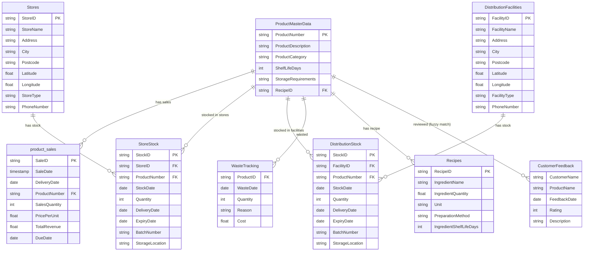

# BigQuery Source Data - Retail Analytics Dataset

This directory contains CSV source files and setup scripts for the Save the Chickens retail analytics platform. The dataset models a multi-store retail operation with distribution facilities, inventory tracking, sales transactions, customer feedback, recipes, and waste management.

## Overview

The dataset supports comprehensive retail analytics including:
- **Multi-store inventory management** with geolocation tracking
- **Distribution center operations** for bulk stock management
- **Sales transaction analysis** with revenue tracking
- **Customer feedback and ratings** analysis
- **Recipe and ingredient tracking** for product composition
- **Waste tracking and optimization** for cost management
- **FDA compliance monitoring** via public data views

## Dataset Structure

### Core Tables

#### 1. ProductMasterData
**File:** `ProductMasterData.csv`  
**Description:** Master catalog of all chicken products sold across stores.

**Schema:**
- `ProductNumber` (STRING): Unique product identifier (e.g., "1001")
- `ProductDescription` (STRING): Full product name and description
- `ProductCategory` (STRING): Product category (whole bird, Chicken Parts, Chicken Byproducts, Chicken Pastries)
- `ShelfLifeDays` (INTEGER): Number of days the product remains fresh after delivery
- `StorageRequirements` (STRING): Storage conditions (e.g., "Refrigerated 2-4°C")
- `RecipeID` (STRING): Optional reference to recipe (e.g., "R001") for products with ingredient breakdowns

**Key Relationships:**
- Links to `Recipes` via `RecipeID`
- Referenced by `product_sales`, `StoreStock`, `DistributionStock`, `WasteTracking`, and `CustomerFeedback`

**Sample Data:**
- 12 products (1001-1012)
- Categories: whole bird, Chicken Parts, Chicken Byproducts, Chicken Pastries
- Shelf life ranges from 2-30 days

---

#### 2. Stores
**File:** `Stores.csv`  
**Description:** Retail store locations across the UK with geolocation data for proximity-based operations.

**Schema:**
- `StoreID` (STRING): Unique store identifier (e.g., "S001")
- `StoreName` (STRING): Store name (e.g., "London Central")
- `Address` (STRING): Street address
- `City` (STRING): City name
- `Postcode` (STRING): UK postcode
- `Latitude` (FLOAT): Geographic latitude for distance calculations
- `Longitude` (FLOAT): Geographic longitude for distance calculations
- `StoreType` (STRING): Type of store (currently "Retail")
- `PhoneNumber` (STRING): Contact phone number

**Key Relationships:**
- Referenced by `StoreStock` via `StoreID`
- Used for proximity-based stock movement planning

**Sample Data:**
- 25 stores across major UK cities
- **Proximity Clusters:**
  - **London:** 4 stores (S001-S004) - Central, West End, Canary Wharf, Stratford
  - **Manchester:** 3 stores (S005-S007) - North, Arndale, Trafford
  - **Birmingham:** 3 stores (S008-S010) - High Street, Bullring, Mailbox
  - **Leeds:** 2 stores (S011-S012)
  - **Edinburgh:** 2 stores (S013-S014)
  - **Glasgow:** 2 stores (S015-S016)
  - **Liverpool:** 2 stores (S017-S018)
  - **Bristol:** 2 stores (S019-S020)
  - **Newcastle:** 2 stores (S021-S022)
  - **Cardiff:** 2 stores (S023-S024)
  - **Sheffield:** 1 store (S025)

**Use Cases:**
- Find nearest stores for stock transfers
- Calculate distances between stores for logistics planning
- Analyze regional sales patterns

---

#### 3. DistributionFacilities
**File:** `DistributionFacilities.csv`  
**Description:** Distribution centers and warehouses that supply stores with bulk inventory.

**Schema:**
- `FacilityID` (STRING): Unique facility identifier (e.g., "DF001")
- `FacilityName` (STRING): Facility name (e.g., "London Distribution Centre")
- `Address` (STRING): Street address
- `City` (STRING): City name
- `Postcode` (STRING): UK postcode
- `Latitude` (FLOAT): Geographic latitude
- `Longitude` (FLOAT): Geographic longitude
- `FacilityType` (STRING): Type of facility (currently "Distribution")
- `PhoneNumber` (STRING): Contact phone number

**Key Relationships:**
- Referenced by `DistributionStock` via `FacilityID`
- Used for distribution-to-store stock movement planning

**Sample Data:**
- 3 distribution facilities:
  - DF001: London Distribution Centre
  - DF002: Manchester Distribution Hub
  - DF003: Birmingham Central Warehouse

**Use Cases:**
- Plan stock transfers from distribution centers to stores
- Optimize distribution routes based on store proximity
- Manage bulk inventory at warehouse level

---

#### 4. StoreStock
**File:** `StoreStock.csv`  
**Description:** Current inventory levels per store per product, with batch tracking and expiry dates.

**Schema:**
- `StockID` (STRING): Unique stock record identifier (e.g., "STK001")
- `StoreID` (STRING): Reference to `Stores.StoreID`
- `ProductNumber` (STRING): Reference to `ProductMasterData.ProductNumber`
- `StockDate` (DATE): Date of the stock snapshot (typically current date)
- `Quantity` (INTEGER): Number of units in stock
- `DeliveryDate` (DATE): Date when stock was delivered to store
- `ExpiryDate` (DATE): Calculated expiry date (DeliveryDate + ShelfLifeDays from ProductMasterData)
- `BatchNumber` (STRING): Batch identifier for traceability (e.g., "BATCH-2024-12-15-001")
- `StorageLocation` (STRING): Physical location within store (e.g., "Refrigerated Aisle 1")

**Key Relationships:**
- Links to `Stores` via `StoreID`
- Links to `ProductMasterData` via `ProductNumber`

**Sample Data:**
- 275 stock records covering all 25 stores × 11 products
- Stock dates: 2024-12-15 (current snapshot)
- Varied quantities to support stock movement scenarios

**Use Cases:**
- Query current stock levels: "Show me stock of product 1001 in store S001 as of today"
- Expiry tracking: "Which items in store S001 are expiring within 2 days?"
- Stock movement planning: "Find stores with excess stock of product 1002 that can supply stores with low stock"
- Batch traceability: Track specific batches for recalls or quality issues

**Example Queries:**
```sql
-- Current stock per store
SELECT s.StoreName, ss.ProductNumber, ss.Quantity, ss.ExpiryDate
FROM StoreStock ss
JOIN Stores s ON ss.StoreID = s.StoreID
WHERE ss.StockDate = CURRENT_DATE()
ORDER BY s.StoreName, ss.ProductNumber;

-- Items expiring soon
SELECT s.StoreName, pm.ProductDescription, ss.Quantity, ss.ExpiryDate
FROM StoreStock ss
JOIN Stores s ON ss.StoreID = s.StoreID
JOIN ProductMasterData pm ON ss.ProductNumber = pm.ProductNumber
WHERE ss.ExpiryDate <= DATE_ADD(CURRENT_DATE(), INTERVAL 2 DAY)
ORDER BY ss.ExpiryDate;
```

---

#### 5. DistributionStock
**File:** `DistributionStock.csv`  
**Description:** Inventory levels at distribution facilities with bulk quantities.

**Schema:**
- `StockID` (STRING): Unique stock record identifier (e.g., "DSTK001")
- `FacilityID` (STRING): Reference to `DistributionFacilities.FacilityID`
- `ProductNumber` (STRING): Reference to `ProductMasterData.ProductNumber`
- `StockDate` (DATE): Date of the stock snapshot
- `Quantity` (INTEGER): Number of units in stock (typically larger than store quantities)
- `DeliveryDate` (DATE): Date when stock was delivered to facility
- `ExpiryDate` (DATE): Calculated expiry date
- `BatchNumber` (STRING): Batch identifier (e.g., "BATCH-DF-2024-12-15-001")
- `StorageLocation` (STRING): Physical location within warehouse (e.g., "Warehouse A Zone 1")

**Key Relationships:**
- Links to `DistributionFacilities` via `FacilityID`
- Links to `ProductMasterData` via `ProductNumber`

**Sample Data:**
- 36 stock records covering all 3 facilities × 12 products
- Larger quantities (80-300 units) compared to store stock

**Use Cases:**
- Plan distribution to stores: "Which distribution center has stock of product 1001 to supply London stores?"
- Bulk inventory management: "What's the total stock across all distribution facilities?"
- Distribution route optimization: "Find nearest distribution center to a store for stock transfer"

---

#### 6. product_sales
**File:** `product_sales.csv`  
**Description:** Historical sales transactions with revenue tracking.

**Schema:**
- `SaleID` (STRING): Unique sale identifier
- `SaleDate` (TIMESTAMP): Date and time of sale
- `DeliveryDate` (DATE): Date when product was delivered (for inventory tracking)
- `ProductNumber` (STRING): Reference to `ProductMasterData.ProductNumber`
- `SalesQuantity` (INTEGER): Number of units sold
- `PricePerUnit` (FLOAT): Price per unit
- `TotalRevenue` (FLOAT): Total revenue for the sale (SalesQuantity × PricePerUnit)
- `DueDate` (DATE): Calculated expiry date (DeliveryDate + ShelfLifeDays)

**Key Relationships:**
- Links to `ProductMasterData` via `ProductNumber`

**Use Cases:**
- Revenue analysis: "What are the top 5 products by revenue this month?"
- Sales trends: "Show me sales trends for product 1001 over the last 3 months"
- Demand forecasting: Used with AI.FORECAST for 30-day predictions

---

#### 7. CustomerFeedback
**File:** `CustomerFeedback.csv`  
**Description:** Customer reviews and ratings for products.

**Schema:**
- `CustomerName` (STRING): Name of the customer
- `ProductName` (STRING): Product name (fuzzy matched to ProductMasterData)
- `FeedbackDate` (DATE): Date of feedback
- `Rating` (INTEGER): Rating score (typically 1-5)
- `Description` (STRING): Feedback text description

**Key Relationships:**
- Fuzzy matched to `ProductMasterData.ProductDescription` via `ProductName`

**Use Cases:**
- Product quality analysis: "What products have the worst customer ratings?"
- Feedback insights: "Show me feedback for whole roasted chicken"
- Product recommendations: Identify high-revenue products with poor reviews

---

#### 8. Recipes
**File:** `Recipes.csv`  
**Description:** Ingredient breakdowns for products that have recipes.

**Schema:**
- `RecipeID` (STRING): Unique recipe identifier (e.g., "R001")
- `IngredientName` (STRING): Name of ingredient
- `IngredientQuantity` (FLOAT): Quantity of ingredient
- `Unit` (STRING): Unit of measurement (e.g., "kg", "g", "ml")
- `PreparationMethod` (STRING): How the ingredient is prepared
- `IngredientShelfLifeDays` (INTEGER): Shelf life of the ingredient

**Key Relationships:**
- Links to `ProductMasterData` via `RecipeID`

**Use Cases:**
- Product composition: "What ingredients are in product 1001?"
- Ingredient tracking: "Which ingredients are used across multiple products?"
- Shelf life analysis: "What's the shelf life of ingredients in chicken pot pie?"

---

#### 9. WasteTracking
**File:** `WasteTracking.csv`  
**Description:** Records of wasted products with cost tracking.

**Schema:**
- `ProductID` (STRING): Reference to `ProductMasterData.ProductNumber`
- `WasteDate` (DATE): Date when waste occurred
- `Quantity` (INTEGER): Number of units wasted
- `Reason` (STRING): Reason for waste (e.g., "Expired", "Damaged", "Quality Issue")
- `Cost` (FLOAT): Cost of wasted product

**Key Relationships:**
- Links to `ProductMasterData` via `ProductID`

**Use Cases:**
- Waste cost analysis: "What's our total waste cost this quarter?"
- Waste pattern analysis: "Which products have the highest waste rates?"
- Optimization: "Recommend discount strategies for products expiring soon"

---

### Views

#### 1. actuals_vs_forecast
**Description:** Combines historical sales data with AI-generated 30-day forecasts using BigQuery's `AI.FORECAST` function.

**Columns:**
- `event_timestamp` (DATE): Date of actual sale or forecast
- `ProductNumber` (STRING): Product identifier
- `quantity_value` (INTEGER): Sales quantity (actual) or forecasted quantity
- `confidence_level` (FLOAT): Forecast confidence (NULL for actuals)
- `prediction_interval_lower_bound` (FLOAT): Lower bound of prediction interval
- `prediction_interval_upper_bound` (FLOAT): Upper bound of prediction interval
- `ai_forecast_status` (STRING): Forecast status
- `data_type` (STRING): "Actual" or "Forecast"

**Use Cases:**
- Compare actual vs forecasted sales
- Analyze forecast accuracy
- Identify products with volatile forecast errors

---

#### 2. products_with_recipes
**Description:** Pre-joined view of products with their ingredient breakdowns.

**Columns:**
- Product fields from `ProductMasterData`
- Ingredient fields from `Recipes`

**Use Cases:**
- Explode products into ingredients
- Analyze ingredient usage across products
- Track ingredient shelf lives

---

#### 3. customer_feedback_with_products
**Description:** Pre-joined view of customer feedback with product master data using fuzzy matching.

**Columns:**
- Product fields from `ProductMasterData`
- Feedback fields from `CustomerFeedback`

**Use Cases:**
- Analyze feedback with product context
- Identify products with poor ratings
- Link feedback to product categories

---

#### 4. fda_chicken_enforcements
**Description:** View of FDA enforcement actions for chicken products from BigQuery public dataset.

**Source:** `bigquery-public-data.fda_food.food_enforcement`  
**Filter:** `product_description LIKE '%chicken%'`

**Use Cases:**
- FDA compliance monitoring
- Recall tracking
- Regulatory action alerts

---

#### 5. store_stock_current
**Description:** Current stock per store with product details, expiry tracking, and **automatic date normalization**.

**Columns:**
- Store fields: `StoreID`, `StoreName`, `City`, `Postcode`, `Latitude`, `Longitude`
- Stock fields: `StockID`, `ProductNumber`, `Quantity`, `BatchNumber`, `StorageLocation`
- Product fields: `ProductDescription`, `ProductCategory`, `ShelfLifeDays`
- **Normalized dates:** `StockDate`, `DeliveryDate`, `ExpiryDate` (automatically adjusted to current date)
- Calculated: `DaysUntilExpiry` (days until expiry from current date)

**Date Normalization:**
This view automatically normalizes all dates to be current, regardless of when the CSV data was created. See the [Date Normalization](#date-normalization-in-stock-views) section below for details.

**Use Cases:**
- Query current stock levels: "Show me stock of product 1001 in store S001 as of today"
- Expiry tracking: "Which items in store S001 are expiring within 2 days?"
- Stock analysis with current dates

---

#### 6. store_stock_expiring_soon
**Description:** Items expiring within 3 days with urgency categorization and **automatic date normalization**.

**Columns:**
- Store fields: `StoreID`, `StoreName`, `City`
- Product fields: `ProductNumber`, `ProductDescription`, `ProductCategory`
- Stock fields: `Quantity`, `BatchNumber`, `StorageLocation`
- **Normalized dates:** `ExpiryDate` (automatically adjusted to current date)
- Calculated: `DaysUntilExpiry`, `ExpiryStatus` (EXPIRED, CRITICAL, URGENT, WARNING)

**Date Normalization:**
This view automatically normalizes all dates to be current. Items are filtered to show only those expiring within 3 days from the current date. See the [Date Normalization](#date-normalization-in-stock-views) section below for details.

**Expiry Status Categories:**
- `EXPIRED`: Expiry date has passed (≤0 days)
- `CRITICAL`: Expires within 1 day
- `URGENT`: Expires within 2 days
- `WARNING`: Expires within 3 days

**Use Cases:**
- Identify items requiring immediate action
- Prioritize stock movement for expiring items
- Waste prevention alerts

---

#### 7. distribution_stock_current
**Description:** Current stock at distribution facilities with product details and **automatic date normalization**.

**Columns:**
- Facility fields: `FacilityID`, `FacilityName`, `City`, `Postcode`, `Latitude`, `Longitude`
- Stock fields: `StockID`, `ProductNumber`, `Quantity`, `BatchNumber`, `StorageLocation`
- Product fields: `ProductDescription`, `ProductCategory`, `ShelfLifeDays`
- **Normalized dates:** `StockDate`, `DeliveryDate`, `ExpiryDate` (automatically adjusted to current date)
- Calculated: `DaysUntilExpiry` (days until expiry from current date)

**Date Normalization:**
This view automatically normalizes all dates to be current. See the [Date Normalization](#date-normalization-in-stock-views) section below for details.

**Use Cases:**
- Plan distribution to stores: "Which distribution center has stock of product 1001 to supply London stores?"
- Bulk inventory management: "What's the total stock across all distribution facilities?"
- Distribution route optimization

---

#### 8. store_stock_summary
**Description:** Aggregated stock summary per store/product with **automatic date normalization**.

**Columns:**
- Store fields: `StoreID`, `StoreName`, `City`, `Latitude`, `Longitude`
- Product fields: `ProductNumber`, `ProductDescription`, `ProductCategory`
- Aggregated: `TotalQuantity`, `BatchCount`, `AvgQuantityPerBatch`
- **Normalized dates:** `EarliestExpiryDate`, `LatestExpiryDate` (automatically adjusted to current date)

**Date Normalization:**
This view automatically normalizes expiry dates to be current. See the [Date Normalization](#date-normalization-in-stock-views) section below for details.

**Use Cases:**
- High-level stock analysis per store
- Identify stores with excess stock (above average)
- Identify stores with low stock (below average)
- Stock movement planning

---

#### 9. store_proximity
**Description:** Distance calculations between all store pairs for stock movement planning.

**Columns:**
- Source store: `StoreFromID`, `StoreFromName`, `StoreFromCity`, `StoreFromLatitude`, `StoreFromLongitude`
- Destination store: `StoreToID`, `StoreToName`, `StoreToCity`, `StoreToLatitude`, `StoreToLongitude`
- Calculated: `DistanceKm` (geographic distance in kilometers), `ProximityType` (Same City / Different City)

**Use Cases:**
- Find nearest stores for stock transfers
- Plan efficient stock movement routes
- Optimize logistics based on proximity

---

### Date Normalization in Stock Views

**Problem:**
The CSV source files contain stock data with fixed dates (e.g., 2024-12-15). When queries are run at arbitrary dates (e.g., in 2025 or later), the views would show no results because all expiry dates are in the past.

**Solution:**
All stock management views (`store_stock_current`, `store_stock_expiring_soon`, `distribution_stock_current`, `store_stock_summary`) automatically normalize dates to be current, regardless of when the CSV data was created.

**How It Works:**

1. **Date Offset Calculation:**
   The views calculate the difference between the latest `StockDate` in the data and `CURRENT_DATE()`:
   ```sql
   WITH DateOffset AS (
     SELECT DATE_DIFF(CURRENT_DATE(), MAX(StockDate), DAY) AS offset_days
     FROM StoreStock
   )
   ```

2. **Date Adjustment:**
   All dates (`StockDate`, `DeliveryDate`, `ExpiryDate`) are adjusted by adding the offset:
   ```sql
   DATE_ADD(ss.ExpiryDate, INTERVAL (SELECT offset_days FROM DateOffset) DAY) AS ExpiryDate
   ```

3. **Automatic Current Dates:**
   This ensures that:
   - If CSV data has dates from 2024-12-15 and you query on 2025-01-15, dates are shifted forward by ~31 days
   - All dates in the view output appear current
   - `DaysUntilExpiry` is calculated correctly relative to today
   - The `store_stock_expiring_soon` view correctly filters items expiring within 3 days from today

**Example:**
- **CSV Data:** StockDate = 2024-12-15, ExpiryDate = 2024-12-18
- **Query Date:** 2025-01-20
- **Offset Calculated:** 36 days (2025-01-20 - 2024-12-15)
- **View Output:** StockDate = 2025-01-20, ExpiryDate = 2025-01-23
- **DaysUntilExpiry:** 3 days (2025-01-23 - 2025-01-20)

**Benefits:**
- ✅ Views always show current, relevant data
- ✅ No need to manually update CSV dates
- ✅ Expiry tracking works correctly at any time
- ✅ Stock movement planning uses current dates
- ✅ Works seamlessly with any query date

**Important Notes:**
- Date normalization only affects the **view output**, not the underlying table data
- The base tables (`StoreStock`, `DistributionStock`) retain their original CSV dates
- Date normalization is recalculated each time the view is queried
- If you update the CSV with new dates, the views will automatically adjust to the new base date

---

## Data Relationships (ER Model)

### Entity-Relationship Diagram



**Key Relationships:**
- **One-to-Many:** One product can have many sales, stock records, waste records, and recipe ingredients
- **One-to-Many:** One store can have many stock records
- **One-to-Many:** One distribution facility can have many stock records
- **Many-to-One:** Many stock records reference one product
- **Fuzzy Matching:** CustomerFeedback.ProductName is matched to ProductMasterData.ProductDescription using LIKE patterns

---

## Setup Instructions

### Prerequisites
1. Google Cloud Project with BigQuery API enabled
2. `gcloud` CLI installed and authenticated
3. `.env` file in project root with `GOOGLE_CLOUD_PROJECT` and `BIGQUERY_DATASET` variables

### Loading Data

Run the setup script to create the dataset, load all tables, and create views:

```bash
cd bigquery_source_data
./setup_bigquery.sh
```

**What the script does:**
1. Creates the BigQuery dataset (if it doesn't exist)
2. Loads all CSV files as BigQuery tables (with autodetect schema)
3. Creates all views (actuals_vs_forecast, products_with_recipes, customer_feedback_with_products, fda_chicken_enforcements)

**Note:** Run the script **outside** of any Python virtual environment to avoid conflicts with gcloud/bq Python dependencies.

### Manual Table Creation

If you prefer to load tables manually:

```bash
# Set variables
PROJECT_ID="your-project-id"
DATASET_NAME="save_the_chickens"
DATASET_ID="${PROJECT_ID}:${DATASET_NAME}"

# Create dataset
bq mk --dataset --location=US "$DATASET_ID"

# Load tables
bq load --source_format=CSV --skip_leading_rows=1 --autodetect --replace \
  "${DATASET_ID}.ProductMasterData" ProductMasterData.csv

bq load --source_format=CSV --skip_leading_rows=1 --autodetect --replace \
  "${DATASET_ID}.Stores" Stores.csv

# ... repeat for other tables
```

---

## Common Query Patterns

### Stock Queries

**Note:** The stock management views (`store_stock_current`, `store_stock_expiring_soon`, etc.) automatically normalize dates to be current. When querying these views, all dates are already adjusted to today's date. See the [Date Normalization](#date-normalization-in-stock-views) section for details.

**Current stock per store (using view - RECOMMENDED):**
```sql
-- Using the view with automatic date normalization
SELECT 
  StoreName,
  ProductDescription,
  Quantity,
  ExpiryDate,
  DaysUntilExpiry,
  BatchNumber
FROM store_stock_current
WHERE StoreName LIKE '%London Central%'
ORDER BY StoreName, ProductDescription;
```

**Current stock per store (querying table directly):**
```sql
-- Querying the base table (dates are NOT normalized)
SELECT 
  s.StoreName,
  pm.ProductDescription,
  ss.Quantity,
  ss.ExpiryDate,
  ss.BatchNumber
FROM StoreStock ss
JOIN Stores s ON ss.StoreID = s.StoreID
JOIN ProductMasterData pm ON ss.ProductNumber = pm.ProductNumber
WHERE ss.StockDate = (
  SELECT MAX(StockDate)
  FROM StoreStock
  WHERE StoreID = ss.StoreID AND ProductNumber = ss.ProductNumber
)
ORDER BY s.StoreName, pm.ProductDescription;
```

**Items expiring soon (using view - RECOMMENDED):**
```sql
-- Using the view with automatic date normalization and expiry status
SELECT 
  StoreName,
  ProductDescription,
  Quantity,
  ExpiryDate,
  DaysUntilExpiry,
  ExpiryStatus,
  BatchNumber
FROM store_stock_expiring_soon
WHERE StoreID = 'S001'
ORDER BY ExpiryDate;
```

**Items expiring soon (querying table directly):**
```sql
-- Querying the base table (dates are NOT normalized)
-- Note: This will only work if CSV dates are current
SELECT 
  s.StoreName,
  pm.ProductDescription,
  ss.Quantity,
  ss.ExpiryDate,
  DATE_DIFF(ss.ExpiryDate, CURRENT_DATE(), DAY) AS DaysUntilExpiry
FROM StoreStock ss
JOIN Stores s ON ss.StoreID = s.StoreID
JOIN ProductMasterData pm ON ss.ProductNumber = pm.ProductNumber
WHERE ss.StockDate = (
  SELECT MAX(StockDate)
  FROM StoreStock
  WHERE StoreID = ss.StoreID AND ProductNumber = ss.ProductNumber
)
  AND ss.ExpiryDate <= DATE_ADD(CURRENT_DATE(), INTERVAL 2 DAY)
ORDER BY ss.ExpiryDate;
```

### Stock Movement Planning

**Find stores with excess stock:**
```sql
SELECT 
  s.StoreName,
  s.City,
  ss.ProductNumber,
  ss.Quantity,
  AVG(ss2.Quantity) AS AvgStockAcrossStores
FROM StoreStock ss
JOIN Stores s ON ss.StoreID = s.StoreID
JOIN StoreStock ss2 ON ss.ProductNumber = ss2.ProductNumber
WHERE ss.StockDate = CURRENT_DATE()
GROUP BY s.StoreName, s.City, ss.ProductNumber, ss.Quantity
HAVING ss.Quantity > AVG(ss2.Quantity) * 1.5
ORDER BY ss.Quantity DESC;
```

**Find stores with low stock:**
```sql
SELECT 
  s.StoreName,
  s.City,
  ss.ProductNumber,
  ss.Quantity,
  AVG(ss2.Quantity) AS AvgStockAcrossStores
FROM StoreStock ss
JOIN Stores s ON ss.StoreID = s.StoreID
JOIN StoreStock ss2 ON ss.ProductNumber = ss2.ProductNumber
WHERE ss.StockDate = CURRENT_DATE()
GROUP BY s.StoreName, s.City, ss.ProductNumber, ss.Quantity
HAVING ss.Quantity < AVG(ss2.Quantity) * 0.5
ORDER BY ss.Quantity ASC;
```

**Calculate distance between stores (for stock transfers):**
```sql
SELECT 
  s1.StoreName AS StoreFrom,
  s2.StoreName AS StoreTo,
  ST_DISTANCE(
    ST_GEOGPOINT(s1.Longitude, s1.Latitude),
    ST_GEOGPOINT(s2.Longitude, s2.Latitude)
  ) / 1000 AS DistanceKm
FROM Stores s1
CROSS JOIN Stores s2
WHERE s1.StoreID != s2.StoreID
  AND s1.City = s2.City  -- Same city for proximity
ORDER BY DistanceKm;
```

### Sales Analysis

**Top products by revenue:**
```sql
SELECT 
  pm.ProductDescription,
  SUM(ps.TotalRevenue) AS TotalRevenue,
  SUM(ps.SalesQuantity) AS TotalQuantity
FROM product_sales ps
JOIN ProductMasterData pm ON ps.ProductNumber = pm.ProductNumber
WHERE EXTRACT(MONTH FROM ps.SaleDate) = EXTRACT(MONTH FROM CURRENT_DATE())
GROUP BY pm.ProductDescription
ORDER BY TotalRevenue DESC
LIMIT 5;
```

### Demand vs Supply Analysis

**Compare stock levels with sales demand:**
```sql
WITH StoreDemand AS (
  SELECT 
    s.StoreID,
    ps.ProductNumber,
    SUM(ps.SalesQuantity) AS MonthlyDemand
  FROM product_sales ps
  JOIN Stores s ON ps.StoreID = s.StoreID  -- Assuming sales have StoreID
  WHERE EXTRACT(MONTH FROM ps.SaleDate) = EXTRACT(MONTH FROM CURRENT_DATE())
  GROUP BY s.StoreID, ps.ProductNumber
),
StoreSupply AS (
  SELECT 
    StoreID,
    ProductNumber,
    SUM(Quantity) AS CurrentStock
  FROM StoreStock
  WHERE StockDate = CURRENT_DATE()
  GROUP BY StoreID, ProductNumber
)
SELECT 
  s.StoreName,
  pm.ProductDescription,
  sd.MonthlyDemand,
  ss.CurrentStock,
  ss.CurrentStock / NULLIF(sd.MonthlyDemand, 0) AS StockToDemandRatio
FROM StoreDemand sd
JOIN StoreSupply ss ON sd.StoreID = ss.StoreID AND sd.ProductNumber = ss.ProductNumber
JOIN Stores s ON sd.StoreID = s.StoreID
JOIN ProductMasterData pm ON sd.ProductNumber = pm.ProductNumber
ORDER BY StockToDemandRatio DESC;
```

---

## Data Maintenance

### Updating Stock Data

Stock data should be updated regularly (daily or real-time) to reflect current inventory levels. The `StockDate` field allows for historical tracking.

**Best Practices:**
- Update `StockDate` to current date for daily snapshots
- Maintain historical records for trend analysis
- Use `BatchNumber` for traceability
- Calculate `ExpiryDate` as `DeliveryDate + ShelfLifeDays` from ProductMasterData

**Date Normalization Note:**
- The stock management views automatically normalize dates, so you don't need to update CSV dates to be current
- However, if you update the CSV with new stock data, the views will automatically adjust to the new base date
- The views calculate the offset from the latest `StockDate` in the data, so adding new records with current dates will shift all normalized dates accordingly
- For production use, consider updating stock data regularly to maintain accurate inventory tracking

### Adding New Stores

1. Add new row to `Stores.csv` with unique `StoreID`
2. Add corresponding stock records to `StoreStock.csv`
3. Reload tables using `setup_bigquery.sh`

### Adding New Products

1. Add new row to `ProductMasterData.csv` with unique `ProductNumber`
2. If product has recipe, add rows to `Recipes.csv` with matching `RecipeID`
3. Add stock records to `StoreStock.csv` and `DistributionStock.csv`
4. Reload tables

---

## File Structure

```
bigquery_source_data/
├── README.md                          # This file
├── setup_bigquery.sh                  # Setup script
├── ProductMasterData.csv              # Product catalog
├── Stores.csv                         # Store locations (25 stores)
├── DistributionFacilities.csv         # Distribution centers (3 facilities)
├── StoreStock.csv                     # Store inventory (275 records)
├── DistributionStock.csv              # Distribution inventory (36 records)
├── product_sales.csv                  # Sales transactions
├── CustomerFeedback.csv               # Customer reviews
├── Recipes.csv                         # Product ingredients
└── WasteTracking.csv                  # Waste records
```

---

## Notes

- **Geolocation:** All stores and distribution facilities include latitude/longitude for distance calculations and route optimization
- **Expiry Dates:** Calculated as `DeliveryDate + ShelfLifeDays` from ProductMasterData
- **Fuzzy Matching:** CustomerFeedback uses fuzzy matching (LIKE patterns) to link to products
- **Batch Tracking:** All stock records include batch numbers for traceability
- **Proximity Clusters:** Stores are grouped in cities to enable realistic stock movement scenarios
- **Date Normalization:** All stock management views (`store_stock_current`, `store_stock_expiring_soon`, `distribution_stock_current`, `store_stock_summary`) automatically normalize dates to be current, regardless of when the CSV data was created. This ensures expiry tracking and stock queries work correctly at any time. See the [Date Normalization](#date-normalization-in-stock-views) section for complete details.

---

## Support

For issues or questions about the data model, refer to the main project README.md or the agent instructions in `chickens_app/agent_instructions.txt`.

