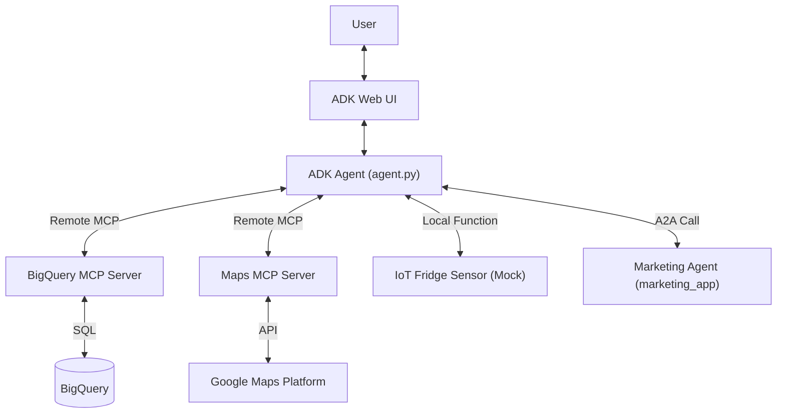

# Save the Chickens - Agent & MCP Architecture

This directory contains the source code for the "Save the Chickens" AI agent.

## Architecture Overview

The agent uses a **Model Context Protocol (MCP)** architecture to decouple the LLM reasoning engine (ADK Agent) from the tool execution environment. It connects to **Remote MCP Servers** for BigQuery and Maps, and uses a local function for the IoT mock.

## Components

### 1. Agent (`agent.py`)
- **Role**: The "Brain".
- **Model**: `gemini-2.5-flash`.
- **Configuration**: Loads environment variables and instructions.
- **Tools**: Configures MCP toolsets and registers A2A tools.

### 2. MCP Tool Configuration (`mcp_server.py`)
- **Role**: The "Connector".
- **Function**: Configures `MCPToolset` for remote MCP servers.
- **Servers**:
    - **BigQuery MCP**: `https://bigquery.googleapis.com/mcp` (Auth: ADC)
    - **Maps MCP**: `https://mapstools.googleapis.com/mcp` (Auth: API Key)
- **Local Tools**:
    - `get_store_temperature(store_id)`: Returns mock IoT sensor data.

### 4. Instructions (`agent_instructions.txt`)
- **Role**: The "Rulebook".
- Contains strict protocols for:
    - SQL generation (fuzzy matching, date handling).
    - Business logic (low stock definitions, waste analysis).
    - Output formatting (markdown tables).
    - **Delegation**: When to call the Marketing Agent.

## Tools Description

| Tool | Description | Source |
| :--- | :--- | :--- |
| `query_dataset` | Executes SQL queries. Requires `db-dtypes` and `tabulate` for formatting. | BigQuery |
| `list_tables` | Lists all tables in the `save_the_chickens` dataset. | BigQuery |
| `get_table_schema` | Returns column names and types for a table. | BigQuery |
| `get_store_temperature` | Returns current temperature and status for store freezers. | Mock IoT |
| `consult_marketing_expert` | Delegates creative writing tasks to the Marketing Agent. | A2A (Marketing App) |

## Development

### Adding a New Tool
1.  **Server**: Add a decorated function `@mcp.tool()` in `mcp_server.py`.
2.  **Client**: Add a corresponding `async def` method in `mcp_client.py` that calls `self._run_tool()`.
3.  **Agent**: Register the new client method in the `tools` list in `agent.py`.
4.  **Instructions**: Update `agent_instructions.txt` to tell the agent when to use it.
